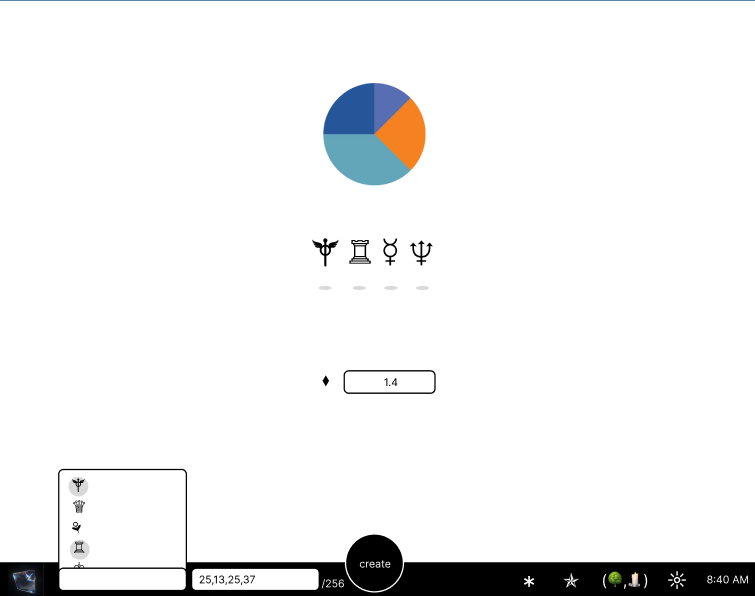

# digital-alchemical-registry
Sourcing inspiration from the idea of building a computer that has multiple facades to benefit a Person, Robot, or Neighbourhood Ecology.

## Questions
- Q: Can you source compute parts to a machine with a round of voting coming to completeness. 
- Q put another way: Can you organize a bid on a computer to be built using an opinionated proposal registry ratio of sized compute versus media NFTs?

## Users Flow
- As an Oracle, I want to deploy a smart contract registry, so that I can manage live rounds of votings so that I can ensure participation repels malice and create a safe computing environnment.
- As an Oracle I want to create a Talis using a distribution of utf-8 that would correspond to registered resources to compete so that I can build a personal computer to an alchemical liking.
- As a proposer, I want to register a resource (CreatorAddress, CID, PeerIdB58, Service-Id, Sizing) so that a market of people can apply voting to either distribute token totems, and / or with the right resources, reward those that rank highest.
- As a proposer, I want to claim a talis resource once the threshold of the submissions matches a sized amount + 1 final vote (to be completed) so that I can get rewarded for my efforts.
- TODO: As an Oracle, I want to be able to rejevenuate unclaimed resources past a certain threshold, if a round of resource proposal was spammed & unclaimed.

## Tests: Example: planet spirit resource orchestration
createTalis(["☿","♀","♁","♂","♄"], [64,64,64,50,14], 100)

registerResource("☿", "bafx", "12D3A", "a-b", 100) // Proposal #0

registerResource("☿", "bafy", "12D3B", "b-c", 200) // Proposal #1

registerResource("☿", "bafz", "12D3C", "c-d", 300) // Proposal #2

giveWeightingVote("☿", 0, 4)

giveTokenVote("☿", 0, 0, 4, true)

giveTokenVote("☿", 1, 0, 4, false)

getVotesOnProposal("☿",0,0)

# Designs

MIT License
